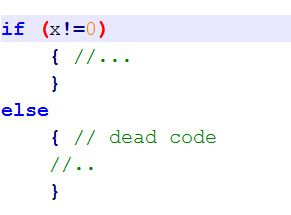

# What is Unreachable Code?
**Unreachable Code** is also known as *Dead Code* in Compiler Design that points to the portion of a program that is never executed under any scenario. This dead code doesn't do any functionality in the program but unnecessarily computation , that describe the program's performance. To optimize softwarea performance within the scope of Compiler Design, the methodology of Unreachable Code Elimination process, provedes practical implementation examples and evaluates the resulting efficiency gains in system resource management.

### Methodologies for Unreachable Code Detection
The identification of unreachable code is a fundamental aspect of compiler optimization, categorized into two primary approaches: **Static** and **Dynamic** analysis.

### 1. Static Analysis Techniques
Static analysis evaluates the program's source code or intermediate representation **without executing the program**. This proactive approach allows for a deep understanding of the program's structure.

* **Control Flow Analysis:** This technique utilizes **Control Flow Graphs (CFGs)** to map every possible execution path within a program. By tracing these routes, we can identify disconnected segments or "islands" of code that are **never reached during execution**. It specifically accounts for:
    *   Conditional Statements (`if/else`)
    *   Loops (`for/while`)
    *   Function Calls and branching constructs.
* **Data Flow Analysis:** This method monitors the **lifecycle of variables**, from declaration to assignment and final usage. Its primary goal is to detect **Dead Stores**—variables that are declared or assigned values but are never subsequently read or used in the source code.

### 2. Dynamic Analysis Techniques
* **Code Coverage Analysis:** This metric calculates the percentage of the codebase **exercised by a specific set of test cases**. It highlights "cold" regions of code that remain unexecuted. Common metrics include:
    *   **Statement Coverage:** Which lines were executed.
    *   **Branch Coverage:** Which logical paths were taken.
    *   **Path Coverage:** Which sequences of branches were followed.
* **Program Profiling:** Profiling involves collecting **real-time execution data**. By analyzing execution traces, developers can pinpoint specific code routes that are never triggered during actual operation, allowing for their subsequent elimination.
